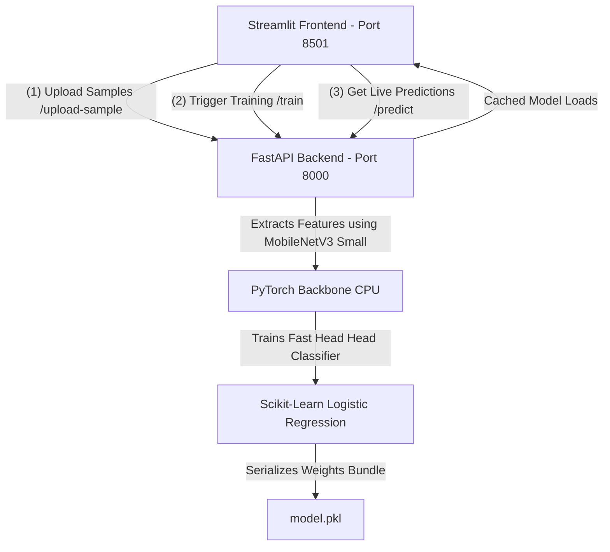

# Teachable Machine Pro: Custom Image Classifier (Decoupled Full-Stack System)

Welcome to **Teachable Machine Pro**! This application is a completely decoupled, high-performance, and client-server clone of Google's Teachable Machine. It is built using **Streamlit** for a premium glassmorphic frontend UI and **FastAPI** for a fast, PyTorch-powered machine learning backend.

This system demonstrates modern cloud-ready design principles by separating heavy deep learning feature extraction (using MobileNetV3) and model training (using Scikit-Learn Logistic Regression) on the backend, keeping the user interface fast, interactive, and responsive.

---

## 🏗️ System Architecture

The application is structured as two independent services communicating over standard HTTP web channels:



1. **Frontend (Streamlit)**: Serves the visual dashboard, handles multi-method sample collection (drag-and-drop file uploader or direct webcam frame grabs), and updates prediction gauges in real-time.
2. **Backend (FastAPI)**: Serves as the computational brain. It ingests sample images, manages local directory structures via Python `os`, extracts feature vectors using a frozen MobileNetV3 backbone, and trains a fast, lightweight Logistic Regression head, saving the weights locally.

---

## 🛠️ Prerequisites

To run this application locally, you will need:
- **Python 3.9 - 3.13** installed on your host system.
- A functional **webcam** (if you want to use the live webcam capture/testing modes).
- **Docker** and **Docker Compose** installed (optional, for containerized execution).

---

## 🚀 Installation & Local Setup

### 1. Install Dependencies
Navigate to the root workspace directory and install all required packages listed in `requirements.txt`:
```bash
pip install -r requirements.txt
```

### 2. Launch FastAPI Backend
Start the backend server on port `8000`:
```bash
python -m uvicorn backend.main:app --port 8000
```
> Verify that the server is alive by navigating to the interactive API docs (Swagger UI) at: `http://localhost:8000/docs`.

### 3. Launch Streamlit Frontend
In a separate terminal shell, launch the Streamlit app on port `8501`:
```bash
python -m streamlit run frontend/app.py --server.port 8501
```
> The dashboard will automatically launch in your browser at: `http://localhost:8501`.

---

## 🐳 Running with Docker (Containerized)

The final challenge containerization allows you to run both services with a single command without needing to install Python or packages locally!

### 1. Build and Run Container Stack
From the project root workspace, execute:
```bash
docker-compose up --build
```

### 2. Access the Application
- **Frontend Dashboard**: `http://localhost:8501`
- **Backend API Docs**: `http://localhost:8000/docs`

> [!NOTE]
> The `backend-dataset` Docker volume maps to `/app/backend/dataset` inside the backend container to ensure that uploaded training samples persist across container builds and restarts.

---

## 📝 User Workflow Guide

1. **Connect System**: Upon opening the Streamlit dashboard, check the sidebar to confirm that the **API Server** displays a green `🟢 Connected` badge.
2. **Add Categories**: Type custom labels (e.g., "Mug", "Book", "Hand") in the category creator field and press `Add Category`. Add at least 2 categories.
3. **Ingest Samples**:
   - Select a category from the selectbox.
   - Choose your ingestion method: **Live Webcam Capture** (take quick camera frames and click *Save Snapshot*) or **Bulk Upload Files** (drag and drop multiple image files and click *Upload*).
   - Ingest at least 1 image per class.
4. **Train Transfer Learning Model**:
   - The checklist will show green checkmarks once eligibility is met.
   - Click the **Train Custom Model** button.
   - The backend will extract a 576-dimensional representation for each image, fit a Scikit-Learn Logistic Regression model, cache the weights, and return success.
5. **Real-Time Visual Prediction**:
   - The **Live Model Testing** panel will unlock automatically.
   - Drag and drop a testing file or capture a webcam test snapshot.
   - Instantly see prediction scores rendered inside premium, customized horizontal confidence progress bars!
6. **Reset Workspace**: Click the **Reset Workspace** button in the sidebar to flush all uploaded datasets and trained weights, bringing the system back to state zero safely.
