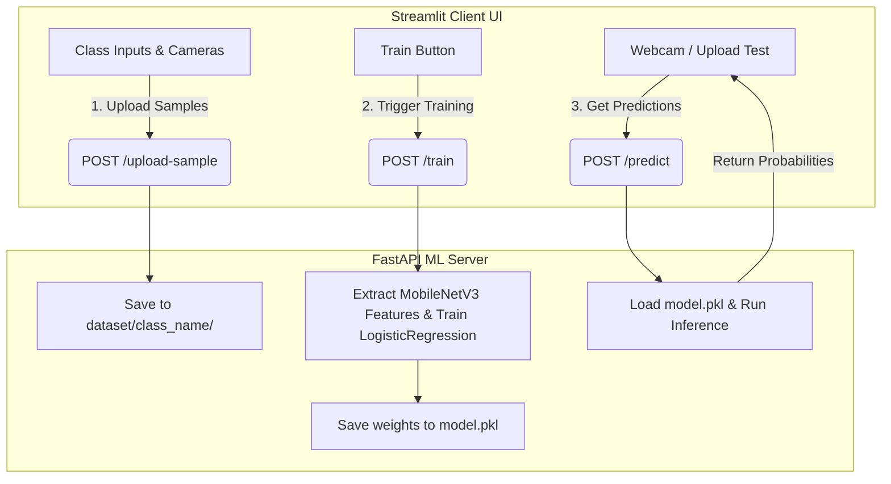

# Teachable Machine: Complete Project Context

This document serves as the absolute reference for our custom decoupled Teachable Machine clone, detailing the architectural specifications, API endpoints, ML pipeline constraints, and visual frontend requirements.

---

## 1. Core Architectural Strategy
The system consists of two completely decoupled services communicating over HTTP:

### Why Decouple?
1. **Frontend Lightweightness**: Streamlit handles user interactions, camera captures, and dynamic data presentation without freezing or crashing under heavy computer vision math.
2. **Backend Scalability**: FastAPI runs asynchronously, processing images, running feature extraction, and fitting classifiers. This layer can easily be moved to high-performance GPU cloud servers in the future without changing the frontend interface.

---

## 2. Machine Learning Engine (Transfer Learning)

Rather than training a deep Convolutional Neural Network (CNN) from scratch—which requires tens of thousands of images and hours of high-compute training—we use a highly efficient **Transfer Learning** architecture.

### Feature Extractor: PyTorch MobileNetV3 Small
*   **Model**: `torchvision.models.mobilenet_v3_small(weights=MobileNet_V3_Small_Weights.DEFAULT)`
*   **Purpose**: Act strictly as a feature extractor (backbone). We freeze all layers and slice off the final classification head.
*   **Output**: For any preprocessed input image, the backbone yields a 1D feature vector representing the image's high-level visual features.

### Classifier: Scikit-Learn Logistic Regression
*   **Model**: `sklearn.linear_model.LogisticRegression`
*   **Purpose**: Learn to separate the custom classes based on the MobileNetV3 feature vectors.
*   **Persistence**: Saved to a localized file `model.pkl` upon successful fitting.

### Preprocessing Uniformity (Critical Rule)
Both the training and inference pipelines must preprocess images in the exact same manner:
1. Convert raw bytes to standard PIL Image.
2. Resize to precisely **$224 \times 224$ pixels**.
3. Convert to a PyTorch Tensor.
4. Normalize using standard ImageNet channel statistics:
   * **Means**: `[0.485, 0.456, 0.406]`
   * **Standard Deviations**: `[0.229, 0.224, 0.225]`

---

## 3. Backend API Specifications (FastAPI)

The FastAPI server must implement the following three key endpoints:

### Endpoint 1: Ingestion
*   **Path**: `POST /upload-sample`
*   **Form Data**: 
    *   `class_name` (string): The label assigned by the user (e.g., "Mug", "Thumbs Up").
    *   `files` (list of uploaded files): The image samples.
*   **Logic**:
    *   Sanitize `class_name` to be a safe directory name.
    *   Ensure directory `backend/dataset/{class_name}/` exists, creating it if missing.
    *   Generate random, safe filenames using `uuid.uuid4()` (e.g., `a7d8c2b5-8c2f-4e8c-8f92-5b8d234c89d7.jpg`) to prevent file collisions.
    *   Write the uploaded file bytes to disk.

### Endpoint 2: Training
*   **Path**: `POST /train`
*   **Logic**:
    *   Verify that `backend/dataset/` contains at least **2 distinct class directories** and that each directory contains at least **1 image sample**.
    *   If check fails, return a graceful HTTP error (e.g., `400 Bad Request`) with a clean error message.
    *   Scan the directories, load images, run the MobileNetV3 feature extraction, fit the Scikit-Learn classifier, and serialize/write it to `backend/model.pkl`.

### Endpoint 3: Inference
*   **Path**: `POST /predict`
*   **Form Data**:
    *   `file` (single uploaded image).
    *   **Logic**:
        *   Load the image, apply the exact $224 \times 224$ normalization preprocessing.
        *   Load `backend/model.pkl`. If the model is not found, return an error.
        *   Extract features and feed them to the classifier.
        *   Return the predicted class name and an array of class probability scores.

---

## 4. Frontend Interface Specifications (Streamlit)

The UI should feel premium, professional, and visually mirror Google's Teachable Machine workflow.

### UI Sections & State Management
*   **State Control**: Keep the interface clean using `st.session_state`. Do not display the prediction/testing panels until a model has been successfully trained (e.g. `st.session_state.is_trained = True`).
*   **Data Collection Section**:
    *   Input box to define custom class names.
    *   Input methods: Toggle between Drag-and-Drop Image Uploader or Live Webcam Capture (`st.camera_input`).
    *   Display of active classes with count of saved images.
*   **Training Action Section**:
    *   "Train Model" primary button.
    *   Beautiful visual loader or spinner when active.
*   **Inference & Testing Section (Gated)**:
    *   Live prediction selector (Webcam feed or File Uploader).
    *   Dynamic bar chart or progress bars displaying prediction confidence percentages for each trained class.

---

## 5. Graceful Error Checklist
The application must handle the following issues without crashing or freezing:
- [x] Clicking "Train" when there are less than two classes populated.
- [x] Sending empty requests to `/predict`.
- [x] Attempting to predict before a model file (`model.pkl`) is successfully created.
- [x] Attempting to write files with corrupted/unsupported formats.
